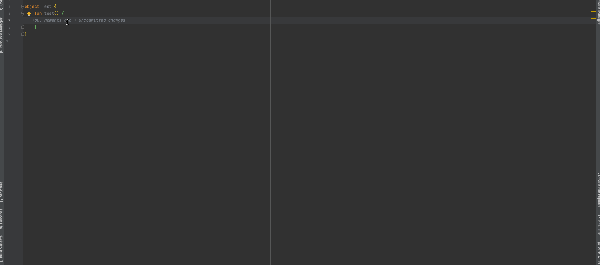

# ComponentBus
ComponentBus 用于组件（module）间的通信, 而不必相互依赖.

ComponentBusVersion = 0.3.0

参考 example 示例

## 1. 混淆
```pro
-keep class cn.moltres.component_bus.* {*;}
-keep class cn.moltres.component_bus.interceptor.* {*;}
-keep class cn.moltres.component_bus.annotation.* {*;}

-keepclasseswithmembers class * implements cn.moltres.component_bus.interceptor.IInterceptor {
    <fields>;
    <methods>;
}
```

## 2. project build.gradle 内添加 ksp 插件
- 仅支持 7.4.2 及以上版本
```groovy
plugins {
    id 'com.android.application' version '7.4.2' apply false
    id 'com.android.library' version '7.4.2' apply false
    id 'org.jetbrains.kotlin.android' version '1.7.10' apply false

    id "com.google.devtools.ksp" version "1.7.10-1.0.6" apply false
    id "cn.moltres.component_bus.register" version "$ComponentBusVersion" apply false
}
```

## 3. app module build.gradle 内添加插件、要扫描的jar包
```groovy
plugins {
    id "com.google.devtools.ksp"
    id 'cn.moltres.component_bus.register'
}

// 扫描列表会根据包名匹配需要扫描的类文件, 包含包内子包下的文件
componentBusExt {
    // 需要扫描的进行添加(拦截器等包名, 可以是主包名)
    packageNameScanList = [
            "com.xxx.bbb",
            "com.xxx.aaa"
    ]
}
```

## 4. module 内添加依赖和 ksp 插件及生成文件引用
```groovy
plugins {
    id "com.google.devtools.ksp"
}

// 添加依赖
api "cn.moltres.component_bus:core:$ComponentBusVersion"
ksp "cn.moltres.component_bus:processor:$ComponentBusVersion"
```

## 5. module 内添加组件 API
```kotlin
@Component(componentName = "组件名称")
object MainComponent {

    @Action(actionName = "事件名称")
    fun event1(params1: Int, params2: Int): Boolean {
        return params1 > params2
    }

    // 挂起函数，必须使用 call 函数调用
    @Action(actionName = "事件名称2", interceptorName = ["拦截器类名称"])
    suspend fun event2(params1: String, params2: String): String {
        return params1 + params2
    }

    // 可以直接返回对应的 Result
    @Action(actionName = "事件名称3")
    fun event3(params1: Int, params2: Int): Result<Boolean> {
        return Result.resultError(code = 1, msg = "参数 params1 应在 0-10 之间")
    }
}
```

## 6. 添加拦截器
```kotlin
object TestInterceptor : IInterceptor {
    override suspend fun <T> intercept(chain: Chain): Result<T> {
        Log.e("TestInterceptor", "${chain.request.componentName} 执行了 TestInterceptor")
        return chain.proceed()
    }

    override fun <T> interceptSync(chain: Chain): Result<T> {
        Log.e("TestInterceptor", "${chain.request.componentName} 执行了 TestInterceptor Sync")
        return chain.proceedSync()
    }
}

object LoginInterceptor : IInterceptor {
    override suspend fun <T> intercept(chain: Chain): Result<T> {
        return if (UsercenterComponent.isLogin == true) {
            chain.proceed()
        } else {
            UsercenterComponent.showLogin()
            Result.resultError(-3, "拦截, 进入登录页")
        }
    }

    override fun <T> interceptSync(chain: Chain): Result<T> {
        return if (UsercenterComponent.isLogin == true) {
            chain.proceedSync()
        } else {
            UsercenterComponent.showLogin()
            Result.resultError(-3, "拦截, 进入登录页")
        }
    }
}
```

## 7. 添加全局拦截器
```kotlin
object LogGlobalInterceptor : GlobalInterceptor() {
    init {
        priority = 10    // 用于设置拦截器的优先级，越高执行顺序越靠前
    }
    override suspend fun <T> intercept(chain: Chain) = chain.proceed<T>().apply {
        Log.i("Component", "Component: ${chain.request.componentName}${Utils.separatorLine}Action: ${chain.request.action}${Utils.separatorLine}Result: ($code) $msg $data")
    }
    override fun <T> interceptSync(chain: Chain) = chain.proceedSync<T>().apply {
        Log.i("Component", "Component: ${chain.request.componentName}${Utils.separatorLine}Action: ${chain.request.action}${Utils.separatorLine}Result: ($code) $msg $data")
    }
}
```

## 8. 调用组件 Action
```kotlin
val result = ComponentBus.with("组件名称", "事件名称")
    .params("params1", 1)
    .interceptors("TestInterceptor")
    .apply {
        params["params2"] = 2   // 两种添加参数方式是等效的
        interceptors.add("TestInterceptor2") 
    }
    .callSync<Boolean>()
```

## 9. AS 插件使用
搜索插件 ComponentBus 添加



### 1. 用于选择组件及事件
快捷键：option + B  
Tools -> ComponentBus -> ComponentSelect

### 2. 导航到该行代码使用的组件名称对应的类
ComponentBus.with("ComponentName", "ActionName")

### 3. 代码提示
输入匹配的组件名提示补全组件名称  
当首字母输入数字时，会显示全部组件名称  
提示所属组为 ComponentBus  
